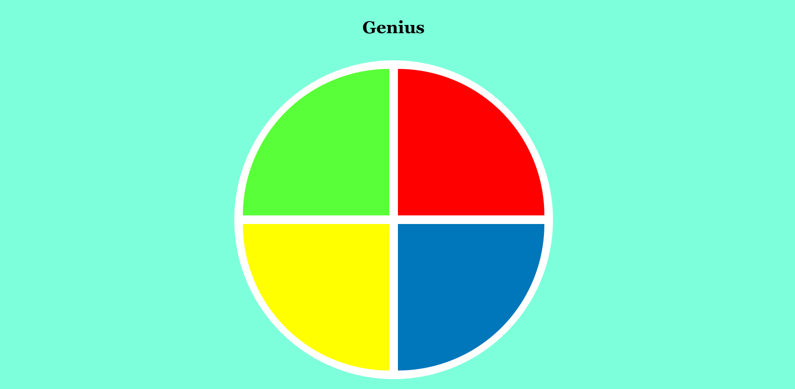

# Genius Game

* Olá, bem vindo ao Genius Game! :game_die:

* Jogo criado no curso "Criando seu jogo de memória estilo Genius" da Digital Innovation One (DIO).

* Nele, CSS Grid, Arrow Functions e manipulação do DOM foram algumas das tecnologias utilizadas. :man_technologist:

* Espero que gostem! :rocket:

* Você pode encontrá-lo <a href="https://doglasrocha.github.io/genius-game/">aqui</a>!

* Imagem do projeto:

  